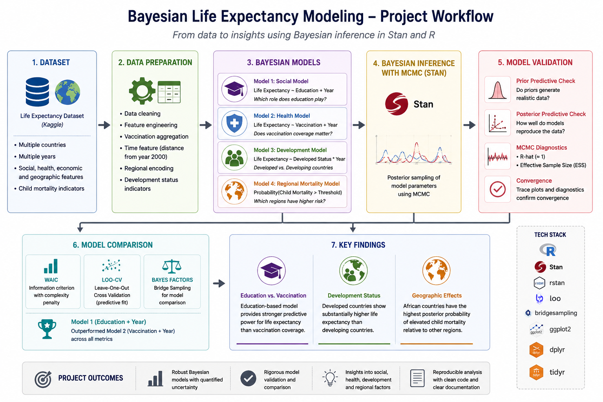

# Bayesian-Life-Expectancy-Modeling
Bayesian modeling and comparative analysis of global life expectancy using Stan and R.

---
<p align="center">
  
</p>

## Overview

This project investigates the factors associated with life expectancy across countries using Bayesian statistical modeling.

The analysis focuses on three main questions:

1. Which predictors provide stronger predictive power for life expectancy: education level or vaccination coverage?
2. How does life expectancy differ between developed and developing countries?
3. Is geographic region associated with elevated child mortality rates?

The project demonstrates end-to-end Bayesian data analysis, including model development, uncertainty quantification, posterior inference, model comparison, and predictive validation.

---

## Dataset

The analysis uses a publicly available Life Expectancy dataset containing country-level observations collected across multiple years.

Key variables include:

* Life expectancy
* Education level (schooling)
* Vaccination coverage
* Economic development status
* Geographic region
* Child mortality indicators

---

## Methodology

### Feature Engineering

Several derived variables were created to support the analysis:

* Average vaccination coverage across multiple vaccine types
* Distance from baseline year (2000)
* Binary indicators for development status
* Regional indicator variables
* Child mortality threshold indicators

### Bayesian Models

#### Model 1: Social Factors Model

Predicts life expectancy using:

* Education level
* Time (year)

#### Model 2: Health Factors Model

Predicts life expectancy using:

* Vaccination coverage
* Time (year)

#### Model 3: Development Status Model

Examines differences in life expectancy trajectories between:

* Developed countries
* Developing countries

#### Model 4: Regional Mortality Model

Estimates the probability that child mortality exceeds a critical threshold across geographic regions.

---

## Bayesian Inference

All models were implemented in Stan and estimated using Markov Chain Monte Carlo (MCMC) sampling.

Posterior inference included:

* Parameter estimation
* Credible intervals
* Posterior predictive distributions
* Hypothesis evaluation using ROPE analysis
* Future forecasting

---

## Model Validation

The project applies several Bayesian model evaluation techniques.

### Prior Predictive Checks

Evaluated whether prior assumptions generated realistic life expectancy distributions before observing data.

### Posterior Predictive Checks

Compared observed data against model-generated samples to assess model fit.

### MCMC Diagnostics

Convergence was evaluated using:

* R-hat
* Effective Sample Size (ESS)
* Trace plots

### Model Comparison

Competing models were compared using:

* WAIC (Widely Applicable Information Criterion)
* Leave-One-Out Cross Validation (LOO-CV)
* Bayes Factors via Bridge Sampling

---

## Key Findings

### Education vs. Vaccination

The education-based model consistently outperformed the vaccination-based model according to:

* WAIC
* LOO-CV
* Bayes Factor comparisons

This suggests that educational attainment provides stronger predictive information for life expectancy than vaccination coverage alone within this dataset.

### Development Status

Developed countries exhibited substantially higher life expectancy than developing countries.

Posterior estimates indicated a large and practically meaningful difference between the two groups.

### Geographic Effects

African countries showed the highest posterior probability of elevated child mortality rates compared with other developing regions.

---

## Repository Structure

```text
├── data/
├── stan_models/
├── scripts/
├── images/
├── report/
└── README.md
```

---

## Future Improvements

Potential extensions include:

* Hierarchical Bayesian models
* Country-level random effects
* Additional socioeconomic predictors
* Time-series Bayesian forecasting
* Causal inference approaches for estimating intervention effects

---
